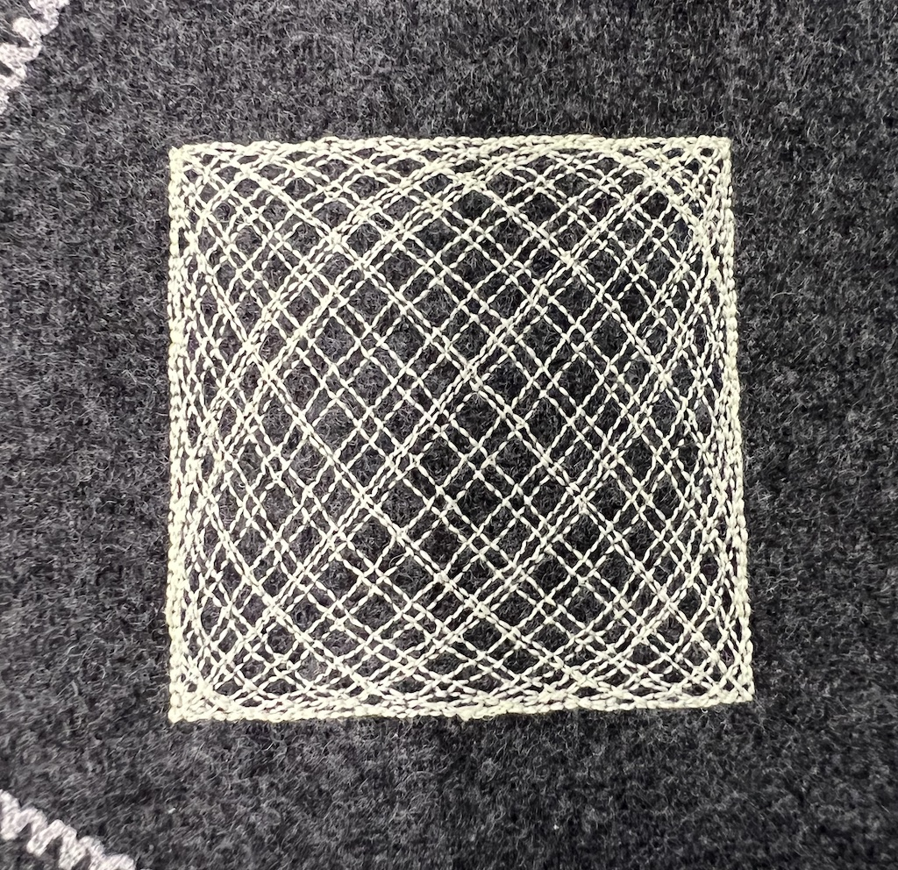
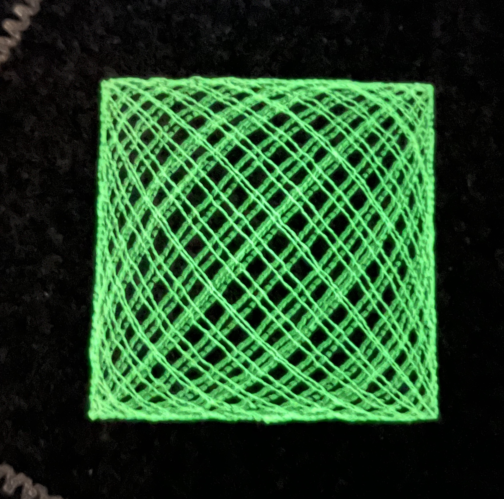

<style>
.p5div{
  padding:10px;
  background:#F0F0F0;
  display: flex;
  align-items: center;
  justify-content: center;
}  
.p5livesample{
  height: 430px;
  width: 410px;
  padding: 0px;
  margin: 0px;
  top: 0%;
  left: 0;
  overflow: hidden;
  border: none;
}
</style>

# p5.jsでデジタル刺繍
{: .no_toc }


本記事は、[Processing Advent Calendar 2023](https://adventar.org/calendars/8532)の9日目の記事です。


<details close markdown="block">
  <summary>
    目次
  </summary>
  {: .text-delta }
1. TOC
{:toc}
</details>

## 概要

本稿では、p5.js を使ってデジタル刺繍をする方法について紹介します。具体的には、p5.js-svgライブラリを利用してスケッチをSVGとして出力し、さらにInkscapeのInk/Stitchアドオンによって刺繍データへと変換する方法とノウハウについて書きます。

## はじめに

p5.jsで生成したグラフィックを画面の外の物理的なモノに出力するというのは何者にも代えがたい魅力があります。これまでのAdventカレンダーを見ても、[印刷](https://note.com/senbaku/n/n63ad8c142275)、[レーザーカット](https://note.com/senbaku/n/n63ad8c142275)、[リソグラフ](https://kagikko.notion.site/kagikko/p5-a89a26fdfa4f4b35be1bcbf10cac8f70)、[刺繍]（https://note.com/yusukesasaki17/n/n249f7b7a4c77）等々といった多彩な応用例が見受けられます。

p5に限らず最近のデジタル刺繍の分野では
[印刷と刺繍を組み合わせたグラフィック表現](https://www.graphicsha.co.jp/detail.html?p=52033)であったり、刺繍データを意図的に破壊して”バグった”意匠を生み出す[グリッチ刺繍](https://nukeme.nu/tagged/Glitch%20Embroidery)などの興味深い例があります。


*デザインのひきだし 50号表紙*

デジタル刺繍は、布や糸の素材の選択により、デジタルデータに半立体の手触りや肌触りを与えることができ、伝統工芸と新しい技術が融合したとても面白い領域です。

一方で、デジタル刺繍を始める上での最大の障壁は、高価なデジタル刺繍ミシンへのアクセスです。デジタル刺繍ミシンは、一般的な家庭用ミシンと比べても高価で、[BrotherのInnovis](https://www.brother.co.jp/product/hsm/embropc/vs/index.aspx)シリーズであれば、最安モデルで20万円以上、高機能モデルで50万円以上となっています。
ところが、[調べてみると](https://www.google.com/search?q=%E5%88%BA%E7%B9%8D%E3%83%9F%E3%82%B7%E3%83%B3+%E3%83%AC%E3%83%B3%E3%82%BF%E3%83%AB%E3%82%B9%E3%83%9A%E3%83%BC%E3%82%B9)意外に、各地のメイカースペースや手芸用品店などで、刺繍ミシンの時間貸しやレンタルをやっているところが多いことがわかります。こうしたサービスを利用することで、大枚をはたいて自分の手元に刺繍ミシンを置かなくても、デジタル刺繍を楽しむことができます。

本稿の手法を使えば、高価な刺繍データ作成ソフトウェアを買わずともジェネラティブ刺繍を作成できるので、ぜひ挑戦してみてください。

ではやっていきましょう。

<!-- とはいえ、著者は、ミシンを触るのが小学校の家庭科以来の非手芸的な人間なため、多々素人くさい間違いが入り込むと思いますがご了承ください。 -->

## デジタル刺繍ミシンの構成


*[Brother Innovis](https://www.brother.co.jp/product/hsm/embropc/vs/index.aspx)*

一般的な家庭用デジタル刺繍マシンは、上の写真の用に
ミシンの布送り部にXY軸で移動するステージが組み合わされており、布を針に対して上下左右に動かすことで刺繍を行う構成になっています。
[刺繍データ](https://edutechwiki.unige.ch/en/Embroidery_format_PES)は、このXY軸の動きと針のZ軸の上げ下げを制御する命令セットで構成されています。
基本的にはCNCマシン、ペンプロッタや、レーザーカッターを制御する[G-Code](https://reprap.org/wiki/G-code)と同種のデータと言えます。


## デジタル刺繍の制作手順

一般的な刺繍データ作成ソフトウェアは、

画像データ　ｰ>　刺繍データ作成ソフトウェア　-> 刺繍データ

といった流れで、画像データを、ミシンの運針データへと変換していきます。

これに対して本稿では、p5.jsとInk/Stitchを組み合わせて

p5.js -> ベクターデータ(SVG) ->　Ink/Stitch　-> 刺繍データ

というふうに、p5の描画プログラムからSVGとしてパスと塗りを出力し、
刺繍ソフトウェアで改めて刺繍データへ変換するという流れになっています。

<!-- p5の描画プログラムと刺繍ソフトウェアを分けることで、出力の際に
使用する布や糸に合わせた刺繍パラメーターの微調整がやりやすくなるという利点があります。
また、ベクターデータのパスを刺繍データの位置指定に直接変換することで
画像ではできない、よりアグレッシブな刺繍の生成を行うことが可能です。 -->


<!-- ## デジタル刺繍ソフトウェア環境


デジタル刺繍のGUI環境としては、各ミシンメーカーが提供している専用ソフトの他に、オープンソースのベクター描画ソフトである[InkScape](https://inkscape.org/)のプラグイン[Ink/Stitch](https://inkstitch.org/)
や

いずれも魅力的な環境なのですが、p5.jsを利用することで新たな描画関数セットを覚えることなく　多くのグラフィックスのリファレンスを利用しながらp5.jsでプログラマブルに刺繍を生成することが可能になります。 -->


## InkscapeとInk/Stitchのインストール

まずは、
下記のURLからInkscapeとInk/Stitchの各インストーラーをダウンロードしインストールします。

- Inkscape : [https://inkscape.org/release/](https://inkscape.org/release/)
- Ink/Stitch : [https://inkstitch.org/docs/install/](https://inkstitch.org/docs/install/)


## SVGモードの導入


次に、お好みのp5エディタにp5.js-svgライブラリを導入し、p5.jsでSVGの出力を可能にする環境を構築します。

  - p5.js-svg [https://github.com/zenozeng/p5.js-svg](https://github.com/zenozeng/p5.js-svg)


index.htmlのヘッダ内に以下の行をに追加します。

```html
    <script src="https://unpkg.com/p5.js-svg@1.5.1"></script>
```
### p5.js対応バージョン(1.6.0)への書き換え

と、ここでいきなり残念なお知らせなのですが、
2023年12月現在、p5.js-svgがサポートするp5.jsのバージョンは1.6.0までとなっており、p5.jsのリンク先指定を1.8.0から1.6.0へと変更する必要があります。


```jsx
  <head>
    <!-- change p5.js version from 1.8.0 to 1.6.0 -->
    <script src="https://cdnjs.cloudflare.com/ajax/libs/p5.js/1.6.0/p5.js"></script>
    <script src="https://cdnjs.cloudflare.com/ajax/libs/p5.js/1.6.0/addons/p5.sound.min.js"></script>

    <!-- add ps.js-svg library -->
    <script src="https://unpkg.com/p5.js-svg@1.5.1"></script>
  </head>
```

## SVGエンジンの指定

p5.js-svgライブラリを導入できたら、createCanvasのレンダラにSVGを指定することで、
p5.jsのキャンバスにてSVGの描画ならびに出力が可能です。

```jsx
function setup(){
  // Set canvas size and rendering mode as SVG
  createCanvas(600, 600, SVG); 
　
　rectMode(CENTER);
  fill(0);
  noStroke();
  rect(width/2,height/2,300,300);
 
  save("rect.svg");
}
```

## SVGの描画を実寸で書き出す

SVGモードの描画を、実寸で書き出すには、

```jsx
//convert mm to pixel
//Inkscape = 96dpi
//Adobe = 72dpi
function mmToPixel(mm,dpi = 96) {
  let inch = mm / 25.4;
  let px = inch * dpi;
 
  return px;
}

function setup() {
  let w = mmToPixel(100); //100mm
  let h = mmToPixel(100); //100mm
  
  createCanvas(w,h,SVG);  //100x100mm
}
```

というようにミリ寸法をSVG標準の96dpiに変換した画素数で
キャンバスや図形サイズを指定します。

注意すべき点は、InkScapeの標準解像度が96dpiである一方で、Adobe IllustratorのSVGインポート/エクスポート時の標準解像度は72dpiだということです。そのため、p5.jsを使って96dpiで出力したSVGファイルをAdobe Illustratorで開くと、サイズが正しく表示されないことがあります。


##　p5.js SVG刺繍用テンプレート

以下に基本的なSVG出力用のp5.jsテンプレートを示します。

[https://editor.p5js.org/didny/sketches/EoPh1s5e_](https://editor.p5js.org/didny/sketches/EoPh1s5e_)
```jsx
function setup(){
  // Set canvas size and rendering mode as SVG
  let w = mmToPixel(100);　//100mm
  let h = mmToPixel(100);  //100mm 
  createCanvas(w, h, SVG); 

  let s = mmToPixel(80);
　
　rectMode(CENTER);
  fill(0);
  noStroke();
  rect(width/2,height/2,s,s);　// rect 80x80mm  
 
  save("rect80mm.svg");
}

function mmToPixel(mm, dpi = 96) {
  // const adobeDPI = 72;
  // let dpi = adobeDPI;
  let inch = mm / 25.4;
  let px = inch * dpi;

  return px;
}

```

<iframe scrolling="no" class="p5livesample"  src="https://editor.p5js.org/didny/full/EoPh1s5e_"></iframe>


## SVG画像の刺繍データへの変換

p5.jsからSVGファイルが出力できたら、
Inkscapeで読み込み、Ink/Stitchで刺繍データを生成します。

Ink/Stitchで出力できる刺繍パターンには大まかに、
ストローク（直線縫い縫い）、サテンカラム（サテン縫い）、塗りつぶしがあります。

次のスケッチで違いを見てみましょう。
https://editor.p5js.org/didny/sketches/x-iFKYowA

```jsx
  //Running Stitch
  noFill();
  stroke(0);
  ellipse(100,height/2, 100,100);
  ellipse(100,height/2, 90,90);
  ellipse(100,height/2, 80,80);
  
  //Satin Column
  noFill();
  stroke(0);
  ellipse(220,height/2, 100,100);
  ellipse(220,height/2, 80,80);
  
  //Fill
  fill(0);
  noStroke();
  ellipse(340,height/2, 100,100);

```


<iframe scrolling="no" class="p5livesample" src="https://editor.p5js.org/didny/full/x-iFKYowA"></iframe>

まずは出力したSVGファイルをInkscapeで開きます。
全体がグループ化されているのでグループ解除(オブジェクト-> グループ解除)のち、
もしbackground()を指定している場合は取り除きます。

## 刺繍パラメーター設定＆刺繍データ生成

次に、刺繍データを生成したい図形を選択して、
メニューからエクステンション -> Ink/Stitch -> パラメーターを指定することで刺繍データ生成のパラメータを指定します。

選択している図形のタイプによって自動的に、ストローク、サテン、塗りつぶしのパラメータータブが展開されます。

## ストローク(直線縫い)


ストロークは、stroke()のパスに沿って縫います。
ランニングスティッチを指定すると、一定間隔で縫い、
マニュアルスティッチを指定すると、パスの頂点vertex()で針の上げ下げを行うように指定できます。

指定可能なストロークの一覧は、[こちらのオフィシャルドキュメント](https://inkstitch.org/docs/stitch-library/)を参照してください。

## サテン（サテン縫い）


サテン縫いは、並列する2つのパスの間をジグザクに刺繍することで
艶のある刺繍の、野球帽のロゴの感じと言えば伝わりやすいでしょうか？


Inkstich でサテン縫いのパラメーターを設定するためには、
パスがサテンカラムという形式で結合されている必要があり、

1. 並列するパスを選択する
2. メニュー -> パス ｰ> 結合 または⌘K

でパスを結合する必要があります。
また結合の際に線や塗りの設定が失われてしまうので再度設定する必要があります。

詳しくは、[こちらのオフィシャルドキュメント](https://inkstitch.org/docs/stitches/satin-column/)を参照してください。


## 塗りつぶし


塗りつぶしはfill()で指定した色で面を縫い潰してくれます。
刺繍データでの色の管理は糸単位で行うので、fill()やstroke()の指定色ごとに糸を分けてデータが出力されます。
塗りつぶしのアルゴリズムを指定することで色々なテクスチャを作れるようです。

詳しくは[こちらのオフィシャルドキュメント](https://inkstitch.org/docs/stitches/fill-stitch/)を参照してください。

## 刺繍データの出力

全てのオブジェクトに対して刺繍パラメータが設定できたら、
刺繍データを出力します。

ファイル -> 保存　メニューから拡張子を選択することで、
指定した各社ミシンに対応した刺繍データを出力できます。
エクステンションのメニューからのエクスポートではないので注意です。


刺繍ミシンの機種によりますが、多くのマシンで
ブラザーの.pes形式あるいはタジマの.dst形式がサポートされているようです。
筆者の環境(BERNINA B590)では.dst形式が一番読み込みが安定しています。

出力したファイルをUSBディスクに移して刺繍ミシンにロードします。


## 出力結果

ここでは[デジタル刺繍マシンの操作方法](https://www.youtube.com/watch?v=bnTv-Jbf46s&ab_channel=BrotherSupportSewing)には触れませんが、

刺繍の際に

 1.布が針とテーブルの動きに引き連れて歪んだり

 2.針穴が集中して布が破れたり

するので、薄い布や伸び縮みする布には不織布などの裏地を当てることが必須です。

初めての試し縫いには、生地の伸び縮みも少なく丈夫なフエルトをおすすめします。

伸縮性が強く脆いTシャツやジャージの生地はなかなか上級者向けです。

以下が出力結果です。


## 作例集

### 作例１：リサージュ刺繍

せっかくコードで刺繍を描くのだから、
ジェネラティブなことをやってみようという試みで単純なリサージュ図形を描いてみました。
なだらかな変化なので刺繍ミシンにも急な移動で負荷がかからず縫いやすいです。

蓄光糸を使って夜光させるとクールです。

<iframe scrolling="no" class="p5livesample" src="https://editor.p5js.org/didny/full/DtBhxE3s3"></iframe>

{: width="400" }
{: width="400" }
{: width="400" }

### 作例２：フラクタルツリー刺繍

せっかくコードで刺繍を描きマシンで刺すのだから、
人手では途方もない時間が掛かりそうな複雑な図案をということでフラクタルなツリーを描いてみました。

[こちらのスレッド](https://codegolf.stackexchange.com/questions/15860/make-a-scalable-christmas-tree)のKeith RandallさんのPythonコードを元にしています。

<iframe scrolling="no" class="p5livesample" src="https://editor.p5js.org/didny/full/TzsM7hcys"></iframe>

{: width="400" }

## まとめ

本稿では、p5.js-svgとInk/Stitchを組み合わせることでデジタル刺繍データを作成する方法を紹介しました。

プログラミングによってデジタル刺繍データを生成する環境には、他にも
本家Processing用[PEmbroider](https://github.com/CreativeInquiry/PEmbroider)や、
Scratch的なコードブロックを組み合わせて刺繍生成プログラムを記述できる[turtlestitch](https://www.turtlestitch.org/)、そしてInk/Stitchのコアを構成するPythonライブラリである[pyembroidery](https://github.com/EmbroidePy/pyembroidery)などがあります。
Ink/Stitchでの刺繍データ出力に慣れたら、これらを用いてより高度なジェネラティブ刺繍データを直接出力してみるのも楽しいかもしれません。

<!-- また、JavaScriptでベクターグラフィックを描画する方法としては、他に[paper.js](https://paperjs.org/)や[maker.js](https://maker.js.org/)などがあります。しかしながら p5.js-svgは、p5.jsの描画関数をそのまま使えるという点でお手軽です。 -->

というわけで、よい年末をー


## References 

- [p5.js-svg](https://github.com/zenozeng/p5.js-svg)
- [Ink/Stitch](https://inkstitch.org/docs/stitch-library/)
- [Working with SVGs in P5JS](https://www.gorillasun.de/blog/working-with-svgs-in-p5js/)