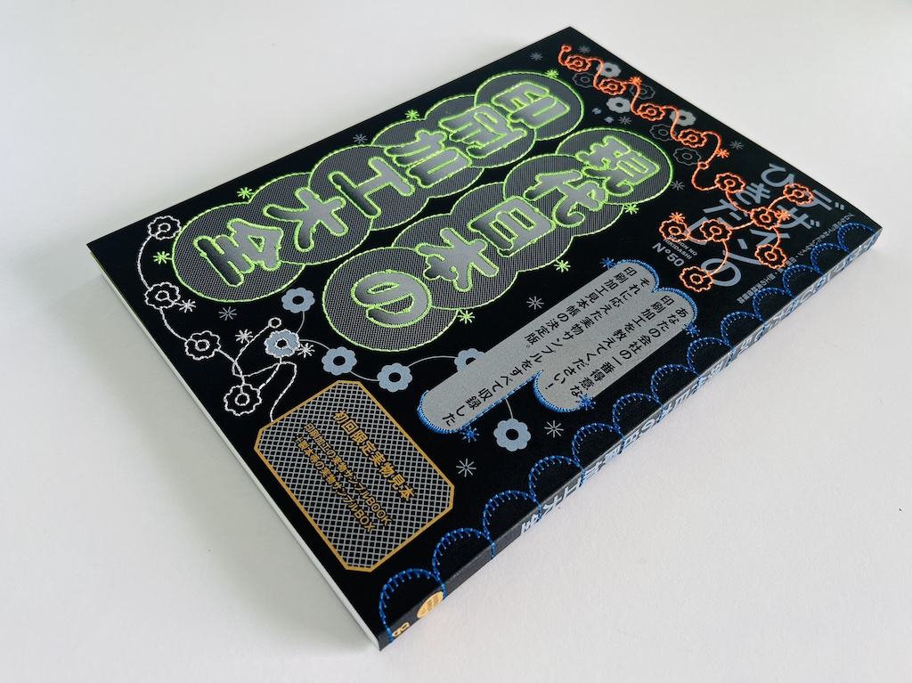
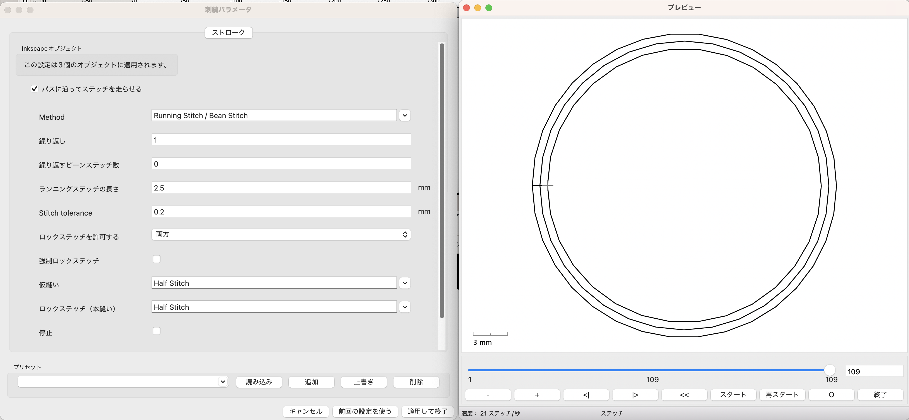
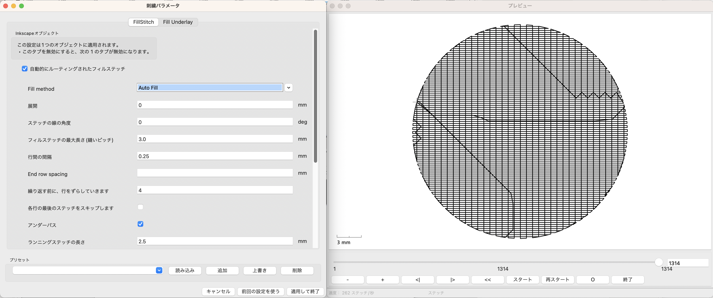
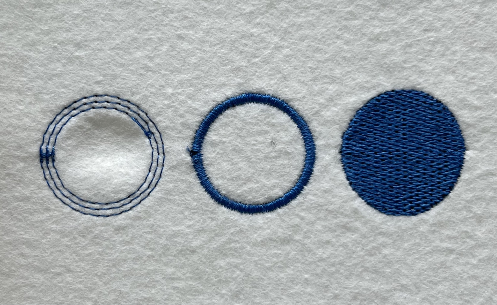

<style>
.p5div{
  padding:10px;
  background:#F0F0F0;
  display: flex;
  align-items: center;
  justify-content: center;
}  
.p5livesample{
  height: 430px;
  /* width: 410px; */
  width: 100%;
  padding: 0px;
  margin: 0px;
  top: 0%;
  left: 0;
  overflow: hidden;
  border: none;
}


</style>

# Digital Embroidery with p5.js
{: .no_toc }


This article is the 9th day article of [the Processing Advent Calendar 2023](https://adventar.org/calendars/8532).


<details close markdown="block">
  <summary>
    目次
  </summary>
  {: .text-delta }
1. TOC
{:toc}
</details>

## Overview

This article introduces the method of creating digital embroidery using p5.js. Specifically, it discusses how to use the p5.js-svg library to output sketches as SVG, and further convert them into embroidery data using the Ink/Stitch extension of Inkscape.

<!-- ## はじめに

p5.jsで生成したグラフィックを画面の外の物理的なモノに出力するというのは何者にも代えがたい魅力があります。これまでのProcessing Adventカレンダーを見ても、[印刷]、[レーザーカット]、[リソグラフ]、[手刺繍](https://note.com/yusukesasaki17/n/n249f7b7a4c77) 等々といった多彩な応用例が見受けられます。 -->

There is an irreplaceable charm in outputting graphics generated with p5.js to physical objects outside the screen. Looking at the past Processing Advent calendars, we can see a variety of application examples such as [printing](https://note.com/senbaku/n/n63ad8c142275), [laser cutting](https://note.com/senbaku/n/n63ad8c142275), [Risograph](https://kagikko.notion.site/kagikko/p5-a89a26fdfa4f4b35be1bcbf10cac8f70), [hand embroidery](https://note.com/yusukesasaki17/n/n249f7b7a4c77), etc.

<!-- デジタル刺繍は、布や糸の素材の選択により、デジタルデータに半立体の手触りや肌触りを与えることができる伝統工芸と新しい技術が融合したとても面白い領域です。 -->

Digital embroidery is a fascinating field where traditional crafts and new technologies merge, allowing digital data to be given a semi-three-dimensional touch and feel through the choice of fabric and thread materials.

<!-- 例えば[印刷と刺繍を組み合わせたグラフィック表現]であったり、刺繍データを意図的に破壊して”バグった”意匠を生み出す[グリッチ刺繍](https://nukeme.nu/tagged/Glitch%20Embroidery)などの興味深い作品があります。 -->

For example, there are interesting works such as [graphic expressions combining printing](https://www.graphicsha.co.jp/detail.html?p=52033) and embroidery, and [glitch embroidery](https://nukeme.nu/tagged/Glitch%20Embroidery) that intentionally corrupts embroidery data to create a 'erroneous' design."


*[Design No Hikidashi Vol.50](https://www.japandesign.ne.jp/news/2023/10/73484/) Embroidery：[Grace Emb Co., Ltd.](http://grace-emb.co.jp/)*

<!-- 一方で、デジタル刺繍を始める上での最大の障壁は、高価なデジタル刺繍ミシンへのアクセスです。デジタル刺繍ミシンは、一般的な家庭用ミシンと比べても高価で、[BrotherのInnovis](https://www.brother.co.jp/product/hsm/embropc/vs/index.aspx)シリーズであれば、最安モデルで20万円以上、高機能モデルで50万円以上となっています。 -->

On the other hand, the biggest barrier to starting digital embroidery is access to expensive digital embroidery machines. Digital embroidery machines are expensive compared to ordinary household sewing machines, and for the [Brother's Innovis series](https://www.brother.co.jp/product/hsm/embropc/vs/index.aspx), the cheapest model is over 200,000 yen, and the high-function model is over 500,000 yen.

<!-- ところが、[調べてみると](https://www.google.com/search?q=%E5%88%BA%E7%B9%8D%E3%83%9F%E3%82%B7%E3%83%B3+%E3%83%AC%E3%83%B3%E3%82%BF%E3%83%AB%E3%82%B9%E3%83%9A%E3%83%BC%E3%82%B9)、意外に各地のメイカースペースや手芸用品店などで、刺繍ミシンの時間貸しやレンタルをやっているところが多いことがわかります。

こうしたサービスと本稿で紹介した手法を利用すれば、高価な刺繍ミシンや刺繍データ作成ソフトウェアを購入することなく、デジタル刺繍を楽しむことができます。デジタル刺繍の制作に挑戦してみてはいかがでしょうか？ -->

However, many maker spaces and craft stores around the country offer time rentals and rentals of embroidery machines.

By using these services and the methods introduced in this article, you can enjoy digital embroidery without having to purchase expensive embroidery machines or embroidery data creation software. Why not try your hand at creating digital embroidery?

Let's get started!

<!-- とはいえ、著者は、ミシンを触るのが小学校の家庭科以来の非手芸的な人間なため、多々素人くさい間違いが入り込むと思いますがご了承ください。 -->

## Structure of a Digital Embroidery Machine


*[Brother Innovis](https://www.brother.co.jp/product/hsm/embropc/vs/index.aspx)*

一般的な家庭用デジタル刺繍マシンは、上の写真の用に
ミシンの布送り部にXY軸で移動するステージを組み合わせて、布を針に対して上下左右に動かすことで刺繍を行う構成になっています。
[刺繍データ](https://edutechwiki.unige.ch/en/Embroidery_format_PES)は、このXY軸の動きと針のZ軸の上げ下げを制御する命令セットで構成されています。
デジタル刺繍データ作成ソフトウェアは、基本的にはCNCマシン、ペンプロッタや、レーザーカッターを制御する[G-Code](https://reprap.org/wiki/G-code)を生成するCAMソフトウェアと同じような役割を果たしています。

A typical household digital embroidery machine, as shown in the above photo, is configured to perform embroidery by combining a stage that moves in the XY axis with the fabric feeding part of the sewing machine, moving the fabric up, down, left, and right relative to the needle. [Embroidery data](https://edutechwiki.unige.ch/en/Embroidery_format_PES) is composed of a set of instructions that control this XY axis movement and the up and down movement of the needle in the Z axis. Digital embroidery data creation software essentially plays the same role as CAM software that generates [G-Code](https://reprap.org/wiki/G-code) to control CNC machines, pen plotters, and laser cutters.

## Digital Embroidery Production Process

Typical embroidery data creation software follows this flow:

Image Data -> Embroidery Data Creation Software -> Embroidery Data

On the graphical interface of the embroidery software, you specify the vector path manually from the image data, specify the thread color and embroidery pattern from that path, and finally output the embroidery data.

In contrast, this article combines p5.js and Ink/Stitch to create a flow like this:

p5.js -> Vector Data (SVG) -> Ink/Stitch -> Embroidery Data

This process outputs paths and fills as SVG from the p5 drawing program, and then converts them into embroidery data again with embroidery software.


## Installation of Inkscape and Ink/Stitch

First, download and install each installer for Inkscape and Ink/Stitch from the URLs below.

- Inkscape : [https://inkscape.org/release/](https://inkscape.org/release/)
- Ink/Stitch : [https://inkstitch.org/docs/install/](https://inkstitch.org/docs/install/)

## Introduction of p5.js-svg Library

Next, introduce the p5.js-svg library to your preferred p5 editor to build an environment that enables SVG output in p5.js."

  - p5.js-svg [https://github.com/zenozeng/p5.js-svg](https://github.com/zenozeng/p5.js-svg)


Add following line to the header of index.html.

```html
    <script src="https://unpkg.com/p5.js-svg@1.5.1"></script>
```

### Rewriting to p5.js Compatible Version (1.6.0)

Unfortunately, as of December 2023, the version of p5.js that p5.js-svg supports is up to 1.6.0, so you need to change the link destination specification of p5.js from 1.8.0 to 1.6.0.


```jsx
  <head>
    <!-- change p5.js version from 1.8.0 to 1.6.0 -->
    <script src="https://cdnjs.cloudflare.com/ajax/libs/p5.js/1.6.0/p5.js"></script>
    <script src="https://cdnjs.cloudflare.com/ajax/libs/p5.js/1.6.0/addons/p5.sound.min.js"></script>

    <!-- add ps.js-svg library -->
    <script src="https://unpkg.com/p5.js-svg@1.5.1"></script>
  </head>
```

## Specifying the SVG Engine

Once you have introduced the p5.js-svg library, you can draw and output SVG on the p5.js canvas by specifying SVG as the renderer in createCanvas.

```jsx
function setup(){
  // Set canvas size and rendering mode as SVG
  createCanvas(600, 600, SVG); 
　
　rectMode(CENTER);
  fill(0);
  noStroke();
  rect(width/2,height/2,300,300);
 
  save("rect.svg");
}
```

## Exporting SVG Drawings in Actual Size

To export drawings in SVG mode in actual size,

```jsx
//convert mm to pixel
//Inkscape = 96dpi
//Adobe = 72dpi
function mmToPixel(mm,dpi = 96) {
  let inch = mm / 25.4;
  let px = inch * dpi;
 
  return px;
}

function setup() {
  let w = mmToPixel(100); //100mm
  let h = mmToPixel(100); //100mm
  
  createCanvas(w,h,SVG);  //100x100mm
}
```

You specify the canvas and figure size in pixel numbers, which are converted from millimeter dimensions to the standard 96dpi of SVG.

One thing to note is that while the standard resolution of InkScape is 96dpi, the standard resolution for Adobe Illustrator's SVG import/export is 72dpi. Therefore, if you open an SVG file output at 96dpi using p5.js in Adobe Illustrator, the size may not be displayed correctly.

## p5.js Template for SVG Output

Below is a basic p5.js template for SVG output.

[https://editor.p5js.org/didny/sketches/EoPh1s5e_](https://editor.p5js.org/didny/sketches/EoPh1s5e_)
```jsx
function setup(){
  // Set canvas size and rendering mode as SVG
  let w = mmToPixel(100);　//100mm
  let h = mmToPixel(100);  //100mm 
  createCanvas(w, h, SVG); 

  let s = mmToPixel(80);
　
　rectMode(CENTER);
  fill(0);
  noStroke();
  rect(width/2,height/2,s,s);　// rect 80x80mm  
 
  save("rect80mm.svg");
}

function mmToPixel(mm, dpi = 96) {
  // const adobeDPI = 72;
  // dpi = adobeDPI;
  let inch = mm / 25.4;
  let px = inch * dpi;

  return px;
}

```

<iframe scrolling="no" class="p5livesample"  src="https://editor.p5js.org/didny/full/EoPh1s5e_"></iframe>


## Conversion of SVG Images to Embroidery Data

Once you can output SVG files from p5.js, load them in Inkscape and generate embroidery data with Ink/Stitch.

The embroidery patterns that can be output with Ink/Stitch roughly include strokes (straight stitching), satin columns (satin stitching), and fills.

Let's see the difference in the next sketch.

[https://editor.p5js.org/didny/sketches/x-iFKYowA](https://editor.p5js.org/didny/sketches/x-iFKYowA)

```jsx
  //Running Stitch
  noFill();
  stroke(0);
  ellipse(100,height/2, 100,100);
  ellipse(100,height/2, 90,90);
  ellipse(100,height/2, 80,80);
  
  //Satin Column
  noFill();
  stroke(0);
  ellipse(220,height/2, 100,100);
  ellipse(220,height/2, 80,80);
  
  //Fill
  fill(0);
  noStroke();
  ellipse(340,height/2, 100,100);

```

<iframe scrolling="no"  class="p5livesample" src="https://editor.p5js.org/didny/full/x-iFKYowA"></iframe>

First, open the output SVG file in Inkscape. The whole objects in the file are grouped, so ungroup it (Object -> Ungroup), and if you have specified background(), remove it.

### Setting Embroidery Parameters & Generating Embroidery Data

Next, select the shape you want to generate embroidery data for, and specify the parameters for generating embroidery data by selecting Extensions -> Ink/Stitch -> Parameters from the menu.

Depending on the type of shape you have selected, the parameter tabs for stroke, satin, and fill will automatically expand."

## Stroke (Straight Stitching)




Strokes are sewn along the path specified by stroke(). If you specify a running stitch, it will sew at regular intervals, and if you specify a manual stitch, you can specify to raise and lower the needle at the vertices of the path.

For a list of possible strokes, please refer to this [official document](https://inkstitch.org/docs/stitch-library/).

## サテン（サテン縫い）


Satin stitching can create embroidery that takes advantage of the luster of embroidery thread by embroidering in a zigzag pattern between two parallel paths. It might be easy to understand if I say it's like the logo on a baseball cap?


To set the parameters for satin stitching in Ink/Stitch, the paths need to be combined in a format called a satin column.

Select parallel paths
Menu -> Path -> Combine or ⌘+K
You need to combine the paths. Also, when combining, the line and fill settings are lost, so you need to set them again.

For more details, please refer to this [official document](https://inkstitch.org/docs/stitches/satin-column/).


## FILL



Fill will sew over the surface in the color specified by fill(). In embroidery data, color management is done on a thread-by-thread basis, so the data is output with the thread divided for each color specified by fill() or stroke(). It seems that you can create various textures by specifying the fill algorithm.

For more details, please refer to this official document.

For more details, please refer to this [official document](https://inkstitch.org/docs/stitches/fill-stitch/).

## Output of Embroidery Data

Once embroidery parameters have been set for all objects, the embroidery data is output.

By selecting the extension from the File -> Save menu, you can output embroidery data compatible with the specified sewing machines. Note that this is not an export from the Extensions menu.


Depending on the model of the embroidery machine, many machines seem to support Brother's .pes format or Tajima's .dst format. In the author's environment (BERNINA B590), the .dst format is the most stable for reading.

Transfer the output file to a USB disk and load it into the embroidery machine.


## Outcome 

We will not go into detail about [how to operate a digital embroidery machine](https://www.youtube.com/watch?v=bnTv-Jbf46s&ab_channel=BrotherSupportSewing) here, but when embroidering,

The fabric may be distorted by being pulled by the movement of the needle and table

The fabric may tear where the needle holes are concentrated

So it is essential to apply a backing such as non-woven fabric to thin or stretchy fabrics.

For your first trial sewing, we recommend felt, which is durable and has little stretch.

Fabrics like T-shirts and jerseys, which are highly stretchy, fragile, and prone to holes, are quite advanced.

The following is the output result.


## Collection of Works

### Example 1: Lissajous Embroidery

Since we're drawing embroidery with code, I tried drawing a simple [Lissajous curve](https://en.wikipedia.org/wiki/Lissajous_curve) in an attempt to do something generative. The gentle change of the sine curve makes it easy to sew without putting a sudden load on the embroidery machine.

It's cool to make it glow in the dark using a phosphorescent thread.

<iframe scrolling="no" class="p5livesample" src="https://editor.p5js.org/didny/full/DtBhxE3s3"></iframe>

{: width="400" }
{: width="400" }
{: width="400" }


## Example 2: Fractal Tree Embroidery

Since we're drawing embroidery with code and stitching it with a machine, I tried drawing a fractal tree, a complex pattern that would take an incredible amount of time to do by hand. 
This is based on [the Python code by Keith Randall](https://codegolf.stackexchange.com/questions/15860/make-a-scalable-christmas-tree) in this thread.

By directly converting the vertex data of the vector data into the position specification of the embroidery data with the manual stitch specification for straight stitching, it is possible to create more three-dimensional and aggressive embroidery, as if the embroidery thread has been replaced with 3D printer filament.

<iframe scrolling="no" class="p5livesample" src="https://editor.p5js.org/didny/full/TzsM7hcys"></iframe>

{: width="400" }


## Conclusion

In this article, we introduced a method to create digital embroidery data by combining p5.js-svg and Ink/Stitch.

There are other environments for generating digital embroidery data through programming, such as [PEmbroider](https://github.com/CreativeInquiry/PEmbroider) for the original Processing, [turtlestitch](https://www.turtlestitch.org/)which allows you to write embroidery generation programs by combining Scratch-like code blocks, and [pyembroidery](https://github.com/EmbroidePy/pyembroidery), a Python library that forms the core of Ink/Stitch. Once you get used to outputting embroidery data with Ink/Stitch, it might be fun to try directly outputting more advanced generative embroidery data using these.

<!-- また、JavaScriptでベクターグラフィックを描画する方法としては、他に[paper.js](https://paperjs.org/)や[maker.js](https://maker.js.org/)などがあります。しかしながら p5.js-svgは、p5.jsの描画関数をそのまま使えるという点でお手軽です。 -->


So, have a happy holiday season with digital embroidery!

## References 

- [p5.js-svg](https://github.com/zenozeng/p5.js-svg)
- [Ink/Stitch](https://inkstitch.org/docs/stitch-library/)
- [Working with SVGs in P5JS](https://www.gorillasun.de/blog/working-with-svgs-in-p5js/)